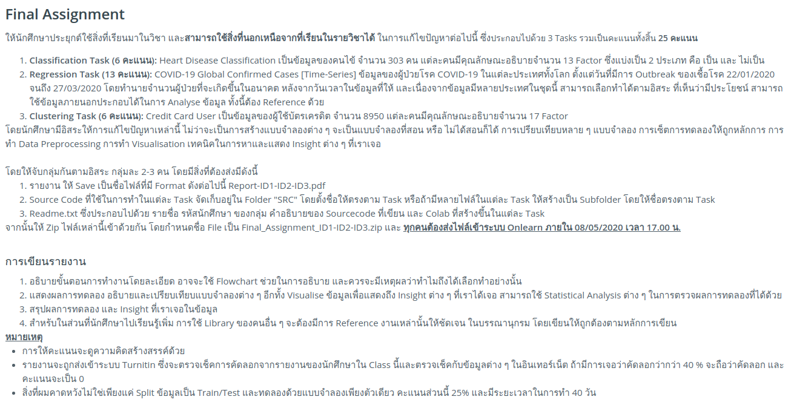
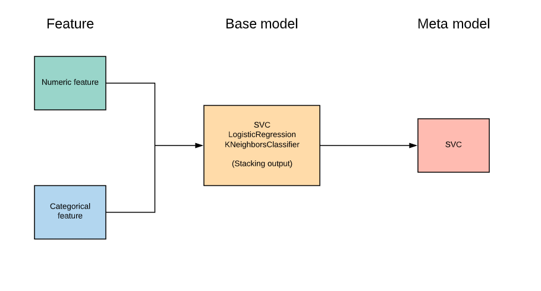
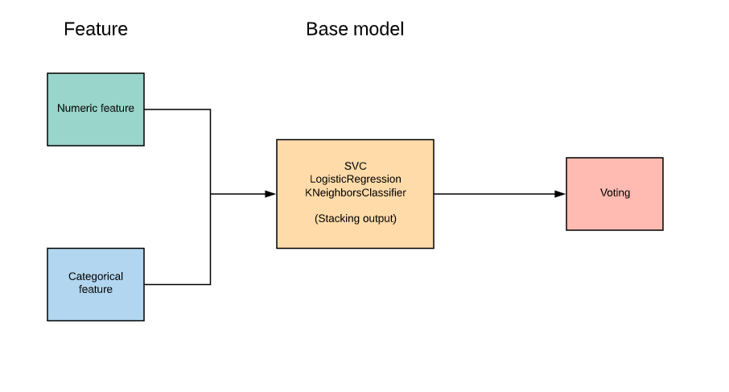
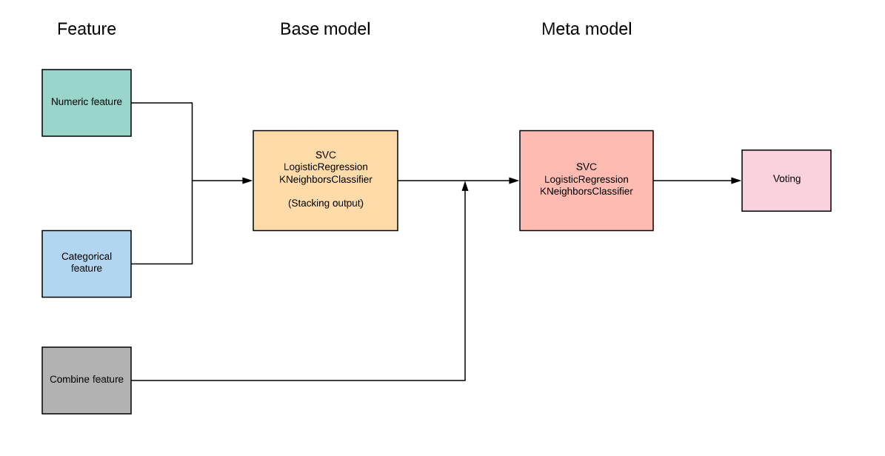
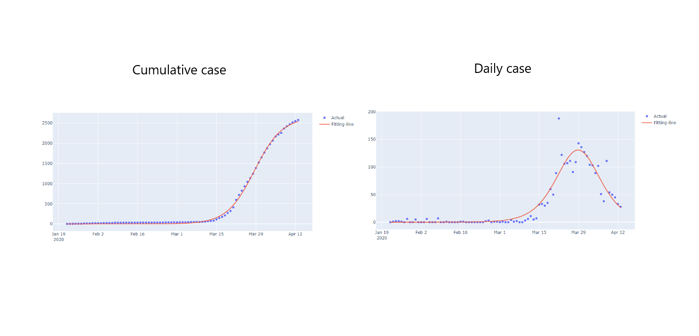
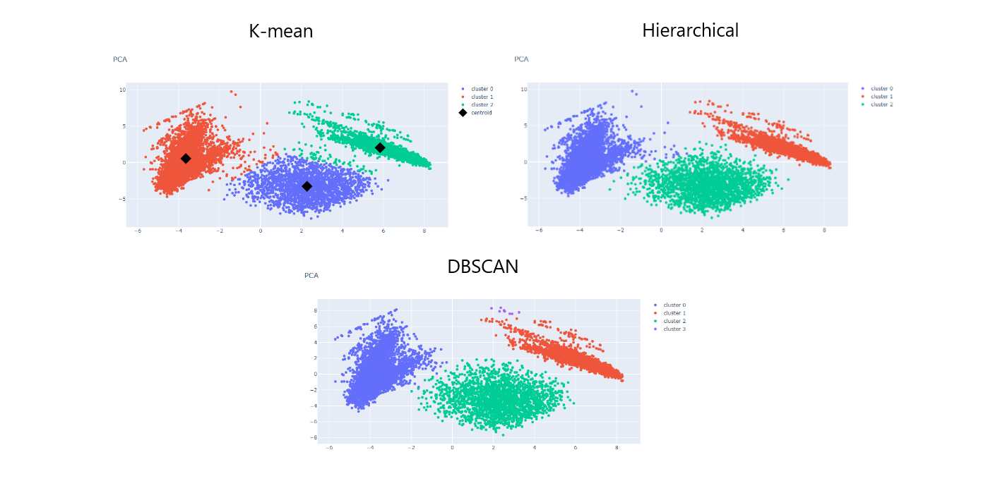
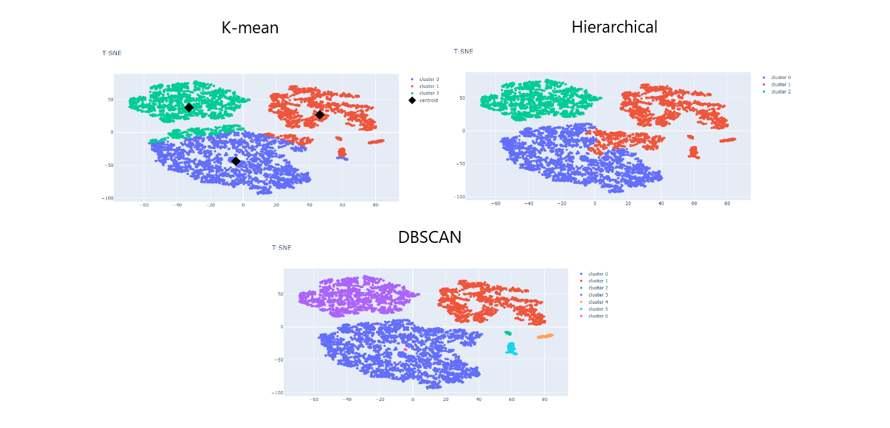

# A Machine learning project (2020)

## Task

* **Classification**: Heart Desease Classification Data has provided a patient about 303 with 13 factors.

* **Regression**: COVID-19 Global Comfirme Cases, this data has provided a patient COVID-19 around the world since 22/01/2020 to 27/03/2020.

* **Clustering**: Credit Card User, this data has provided a credit card for each user with 17 factors.

## Criteria

## Showcase

### Task 1

model architecture

* Simple stacking

* Majority vote

* Stacking + Majority vote with multi-meta-learner

### Task 2

### Task 3

## Team

|  |  |  |
| ------------- | :-------------: | :-------------: |
| 60070134 Nut Chukmaphaeng | 60070135 Nattanicha  Chaisiripanich | 60070144 Nonthakorn  Markeeree |
